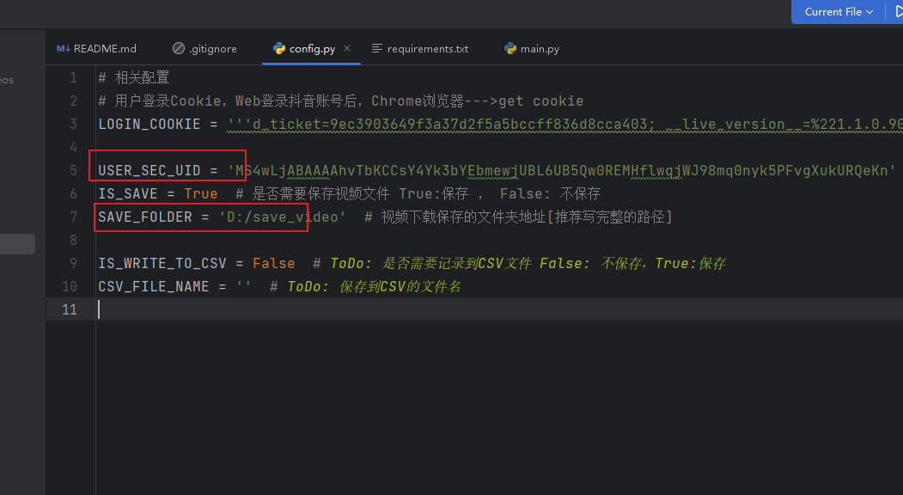
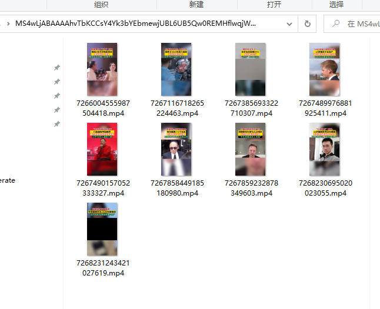

# Spider_DouYin_Videos

---
有任何会提 欢迎咨询: ytouching

爬取指定抖音用户的所有公开视频，并且下载到指定文件夹 【良心教程】
需要帮助的请加微信：ytouching  （有偿帮助，不要想着白嫖，希望理解，否则拉黑啦！）

大家也可以通过[腾讯云服务器](https://curl.qcloud.com/tTuWmDCs) 上去购买云服务器部署
---

### 环境配置

* 安装Python >= 3.6.8  [Python下载地址](https://www.python.org/)
* ```pip install -r requirements.txt```
* 需要安装node和npm 安装最新版本即可【之前忘记说了 害一些朋友没法用】

### 配置需要爬取的抖音账号以及视频文件保存位置
* 打开 ```config.py```文件,修改```USER_SEC_UID```和 ```SAVE_FOLDER```两个参数

* ```USER_SEC_UID``` 表示用户的抖音账号ID，```SAVE_FOLDER``` 表示需要保存到的文件夹位置
---
#### USER_SEC_UID 的获取方式
* 1. Chrome浏览器打开```https://www.douyin.com/```
* 2. 打开指定用户的首页 例如```https://www.douyin.com/user/MS4wLjABAAAAhvTbKCCsY4Yk3bYEbmewjUBL6UB5Qw0REMHflwqjWJ98mq0nyk5PFvgXukURQeKn```
* 3. 此时网址链接中会显示类似: https://www.douyin.com/user/xxxxxxxxxx  其中xxxxx则为用户的id,即USER_SEC_UID，配置即可

### 运行程序
* 设置好USER_SEC_UID和SAVE_FOLDER之后，运行```main.py```文件即可

* 运行结束之后，会在对应文件夹，生成如下的视频列表，即说明下载成功


---

### 更新说明
* V1.0.1
增加了命令行参数调用
可以通过``` python .\main.py  MS4wLjABAAAAhvTbKCCsY4Yk3bYEbmewjUBL6UB5Qw0REMHflwqjWJ98mq0nyk5PFvgXukURQeKn D:/demo```来设置参数
其中第一个参数为用户id, 第二个参数为默认保存位置


## 赞赏！！！
* 如果对大家有帮助的话，可以扫码赞赏一下！


* 有爬虫需要可以加V：ytouching
* Phone: 13824464121
